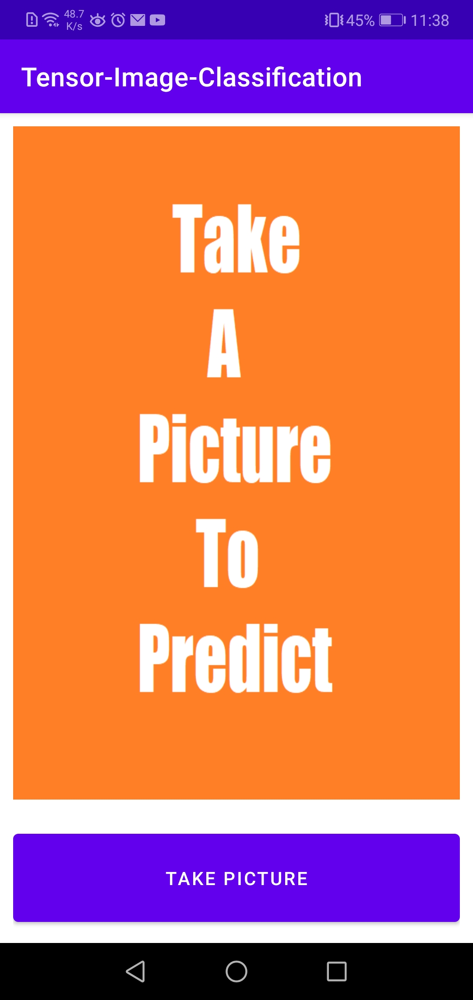

# Image Classification Android App (Java) Using Tensorflow

The objective of this project is to classify an image taken by the phone camera. But as the model file is very big and can not be uploaded in Github, i also describe the process of training the image classification model here.

So the main parts of this project will be:

1. Train the image classification model
2. Convert tensorflow model to tflight (To integrate in the android app)
3. Develop the android app

## Train the image classification model

I use transfer learning from pre-trained InceptionV3, made the last 15 layers trainable, and add a few layers on top of it. I do not perform that much image processing or data analysis as it is not the main purpose of this project.

But I use an Image-data-generator for some basic image augmentations. Also, I use flow_from_directory which do not load the full dataset at a time but load batch of data, augment it and feed to the network.

NOTE: One important thing worth to mention, "ImageDataGenerator" does not produce more data for the training, but replaces the original image batch with the augmented/Randomly transformed data. Also to train the image classifier like me (using flow-from-directory), the structure of the dataset folder should be similar to me as it is the expected data directory by TensorFlow.

I train the model for just 50 epochs and got around 90% accuracy.

The daraset, training script (train.py), model testing script (predict.py) and the model convertion script (convert_to_tflight.py) can be found in <strong>"TensorImageClassification/app/src/main/ML_materials/"</strong> directory

## Convert tensorflow model to tflight

Converting a Tensorflow model to tflite format is very simple.
Just load the model using:
>tensorflow.keras.models.load_model(saved_model_dir)

Initialize the converter using:
>tensorflow.lite.TFLiteConverter.from_keras_model(model)

Then convert the model using the initialized converter.

## Develop the android app

### UI

This is a single-page application. You can create your own UI as you like. My UI is very simple.
Here is the home page:

And here is how my prediction looks like:

### Java Code Segment

<strong>ImageClassifier.java</strong> file performs all the image classifications related takes. The three main functions are:

1.  ImageClassifier
> This function loads the Tensorflow model (converted in tflite) and the Label

2. loadImage
> This function loads the image taken by the phone camera and performs necessary preprocessing steps.

3. recognizeImage
> This function classify the image and return the best prediction

